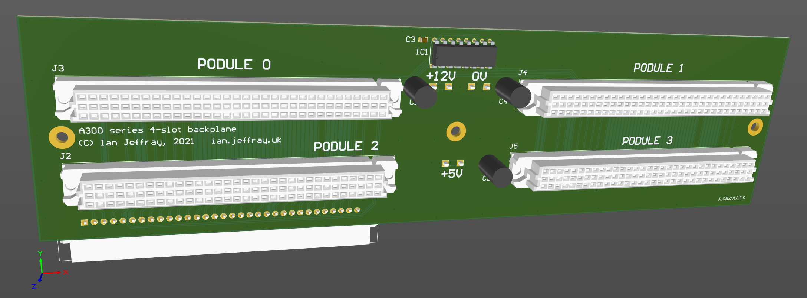

# Acorn A300 four-slot backplane

March 2023

This is my implementation of a four-slot backplane for Acorn A305 and A310 machines.

The design has been successfully tested in several machines.

## Licence

No warranty is provided, and this work is used at your own risk.  

Licenced as CC BY-SA 3.0

Copyright 2023 Ian Jeffray

